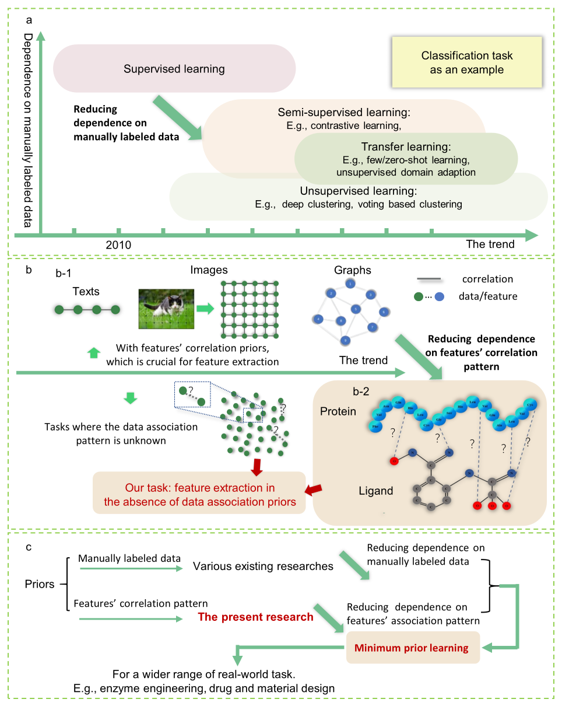
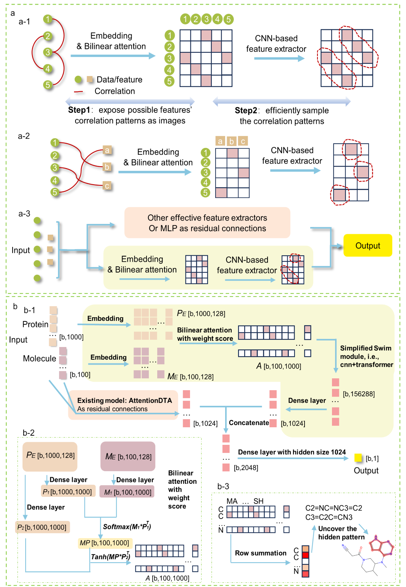

# Introduction
While the inherent correlation patterns between manual annotations and sample features are key prior knowledge in model design, capturing this knowledge increases the complexity and cost of solution deployment. As a result, AI research is increasingly focused on reducing reliance on such prior knowledge and moving toward learning paradigms that rely less on manual annotation, such as transfer learning, semi-supervised learning, and unsupervised learning. In real-world scenarios, especially in the field of protein-ligand interactions, it is very difficult to obtain prior knowledge about feature correlation patterns, limiting the efficiency of models in identifying effective binding patterns. Although molecular dynamics simulations are very accurate in predicting the free energy of specific binding modes, they require a lot of computational resources. As an alternative, deep learning offers a powerful solution by learning directly from data, although precisely identifying binding patterns remains a challenge. Research is focusing on integrating prior knowledge and using advanced training methods to improve the efficiency of feature extraction. However, current research does not directly address the consequences of the lack of prior knowledge of protein-ligand binding tendencies, which makes models mostly ineffective in terms of the importance of distinguishing between different binding modes. Therefore, developing effective modeling techniques that do not rely on established feature-related patterns is critical to solving real-world problems, but formulating effective feature extraction mechanisms in the absence of such prior knowledge remains an under-explored area.

Figure 1 illustrates the evolution of deep learning technologies, focusing on the diminishing reliance on prior knowledge. Key points include: a) The shift from supervised to unsupervised learning marks a significant move away from the need for manually annotated data, indicating a broader trend towards minimizing prior knowledge requirements. b) Understanding feature correlation patterns in data is crucial, as these patterns significantly inform the learning process (see b-1). However, in complex cases like protein-ligand interactions, identifying these patterns can be challenging (see b-2). This complexity underscores the importance of developing models that can learn effectively without predefined knowledge of feature correlations. c) Efforts to reduce dependence on known feature correlation patterns are parallel to the push for less reliance on manual data annotation. Both aims are foundational to ongoing research efforts. Our study introduces the "minimal prior learning" approach to lower the barriers to entry for deep learning application, aiming to expand its use across various fields by lessening the need for both manual annotation and established feature correlations. 

## Method
The essence of predicting protein and ligand binding lies in identifying and validating highly specific complementary binding patterns from a multitude of potential patterns. Due to the lack of prior knowledge about amino acid and molecular binding trends, it remains challenging to effectively avoid sampling of ineffective binding patterns regardless of the modeling strategy chosen. Therefore, our modeling work is aimed at 1) expanding the range of sampling binding modes and 2) improving sampling efficiency, as shown in Figure 2-A. Our core approach consists of three parts, as shown in Figure 2-b:
1) The sampling range of potential binding patterns is expanded. Our method is further refined by the introduction of weight scores by leveraging pre-existing embedding and bilinear attention mechanisms, as shown in Figures 2-b-1 and 2-b-2. To ensure consistent sequence length, we used fill and truncation techniques to normalize molecular sequences to 85 characters and protein sequences to 1200 characters. By embedding, these numerical ids are converted into high-dimensional, trainable vectors. Using bilinear attention, we construct an 85*1200 correlation matrix that reveals the binding pattern between amino acids and atoms, as shown in Figures 2-a-2 and 2-b-1.
2) Improve sampling efficiency. To effectively identify binding patterns in protein and molecular sequence correlation matrices, we use a CNN-based module supplemented by a simplified swin transformer architecture, as shown in Figure 2-b-1.
3) Use the existing feature extraction module as residual. In order to enhance the ability of our model to extract features from protein and molecular sequences, we add residual module to the existing feature extractor. We chose AttentionDTA here because among existing frameworks, this framework also specifically uses sequence information as input. Finally, the output of these residual modules is combined with the output of the relevant feature extraction module to accurately predict the affinity label. The loss function is constructed by utilizing mean square error (MSE) or cross entropy, calibrated against the actual affinity label.

Figure 2 illustrates the modeling approach and framework of the model. a) Input data undergo embedding and bilinear attention with weight score mechanisms to construct a feature correlation matrix, presenting all potential correlation patterns in an unbiased image format. Subsequently, a CNN-based feature extraction module efficiently samples correlation patterns from this matrix (see a-1 and a-2). Additionally, existing modules serve as residual connections to augment feature extraction (see a-3). b) The schematic diagram outlines the network architecture for protein and molecule binding prediction (see b-1). The length of the protein sequences is 1000, and the length of the molecular SMILES sequences is 100. These values vary across different datasets. Bilinear attention introduces a weight matrix for the correlation matrix (see b-2). A simplified swin transformer model, a CNN-based feature extraction module, then efficiently samples binding patterns from the constructed correlation matrix (see b-1). The AttentionDTA (Zhao et al., 2019) acts as a residual module, supplementing feature extraction. Utilizing the trained protein and molecule sequence correlation matrices, binding site information for proteins and molecules can be deduced in reverse (see b-3). 

# Enviroment

First, make sure you have Python and the following dependencies installed:
- PyTorch=2.0
- torchvision
- numpy
- pandas
- tqdm
- matplotlib
- scikit-learn=1.2.2

# File structure
The file structure of the project is as follows：
- project_root/
  - enviroment/
  - data/
    - CIFAR10/ 
    - demo_davis/
    - dis_result/
    - flower/
    - middle_davis
  - code
    - ckpt/
    - result/
    - dislocate.py 
    - log.log
    - main.py
    - model.py
    - README.md
    - run.sh
    - transformer_50.pth
    - util.py

# How to run
- cd code
    - step 0, `python dislocate.py` Go and scramble the original image. The result is given in folder 'data/dis_result'
    - step 1, `python main.py`      to train and test Protein-molecule affinity. The result is given in folders 'code/transformer_50.pth' and 'code/log.log'

